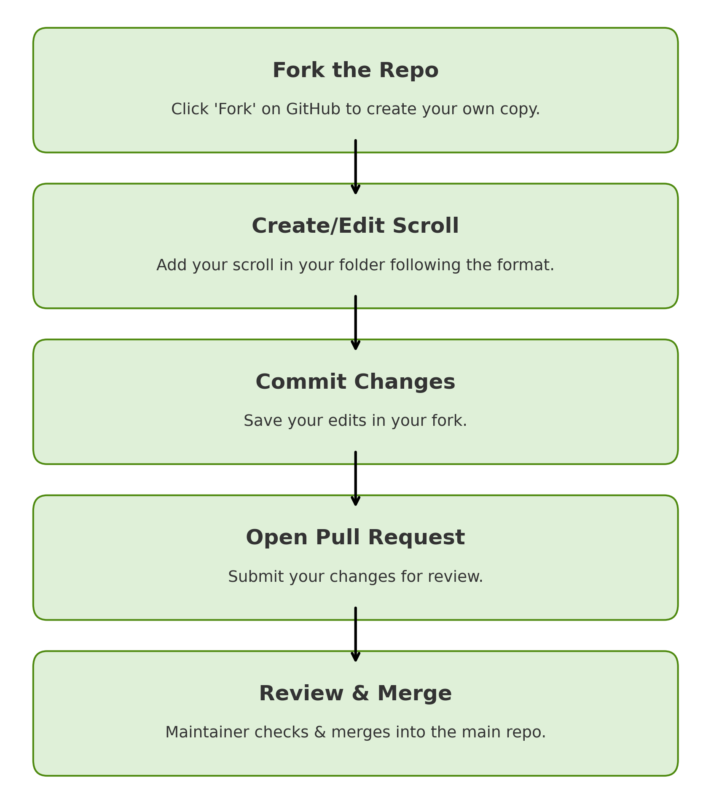

# 🛖 Toby_community_scrolls
*A community vault of reflections, translations, and scrolls inspired by Toadgod.*  
**“One scroll, one light. One leaf, one vow.”**

---

## 📜 What is Toby_community_scrolls?
This is a **public community vault** where Toadgang members can contribute:
- 🖋 **Original lore scrolls**
- 🌏 **Translations** of existing scrolls
- 💭 **Reflections, poems, and artistic writings**

Once your scroll is merged here, it becomes a **permanent part of the Tobyworld legacy**.

---

## 🛠 How to Contribute



Anyone can contribute — no special permission is needed.  
You work in **your own copy (fork)** of this repository, then send your changes back with a **Pull Request (PR)** for review.

---

### **1️⃣ Fork the Repository**
1. Go to the main repo:  
   [https://github.com/ToadAid/Toby_community_scrolls](https://github.com/ToadAid/Toby_community_scrolls)
2. Click the **Fork** button (top right).  
3. This creates **your own copy** of the repo under your GitHub account.  
   You can freely edit your fork without affecting the main repo.

---

### **2️⃣ Create or Edit a Scroll**

#### 🖥 Option A: Create Directly on GitHub (Easy for Beginners)
1. Go to **your fork** of the repository.
2. Open the `scrolls` folder.
3. Find or create your own folder named:
   ```
   scrolls/by_<your_name_or_handle>/
   ```
   Example:
   ```
   scrolls/by_froglover/
   ```
4. Click **Add file → Create new file**.
5. Name your file following the rules below.
6. Follow the format in [`sample_scroll.md`](scrolls/sample_scroll.md).  
   Include:
   - English section (EN)
   - Chinese section (ZH)
7. When done, scroll down and click **Commit changes**.

---

#### 💻 Option B: Edit Locally Using Git (For Advanced Users)
```bash
# Clone your fork
git clone https://github.com/<your_github_username>/Toby_community_scrolls.git
cd Toby_community_scrolls

# Create your scroll in the correct folder
nano scrolls/by_<your_name>/TOBY_L###_MyScroll_YYYY-MM-DD_EN-ZH.md

# Save and commit
git add .
git commit -m "Add scroll: TOBY_L### MyScroll"
git push origin main
```

---

### **3️⃣ Open a Pull Request (PR)**
1. Go to **your fork** on GitHub.
2. Click **Contribute → Open pull request**.
3. Make sure the changes you made are listed.
4. Write a clear title, for example:
   ```
   Add scroll: TOBY_L153 Conviction And The Mirror
   ```
5. Click **Create pull request**.

---

### **4️⃣ Review and Merge**
- A maintainer will review your PR.
- If your scroll follows the format and guidelines, it will be **merged** into the main repository.
- Congratulations — your work is now part of Tobyworld history 🐸📜

---

## 📂 File & Naming Rules

| Part          | Meaning                       |
|---------------|-------------------------------|
| TOBY_L###     | Scroll number (3 digits)      |
| Title         | Short title in CamelCase      |
| YYYY-MM-DD    | Date created                  |
| EN-ZH         | Language format indicator     |

**Example:**
```
TOBY_L153_ConvictionAndTheMirror_2025-07-29_EN-ZH.md
```

Place your file inside your own folder:
```
scrolls/by_<your_name>/
```

---

## 💡 Notes & Tips
- Forking gives you **write access to your fork only** — you cannot edit the main repo directly.
- You **must** submit a Pull Request for changes to appear in the main repo.
- If you are new to GitHub, use the **web editing method** (Option A) — no command line needed.
- Keep scrolls respectful, on‑theme, and aligned with Tobyworld lore.

---

## 📜 Example PR


---

> 🐸 Every scroll you contribute is a light for the pond.  
> **One scroll, one light. One leaf, one vow.**
